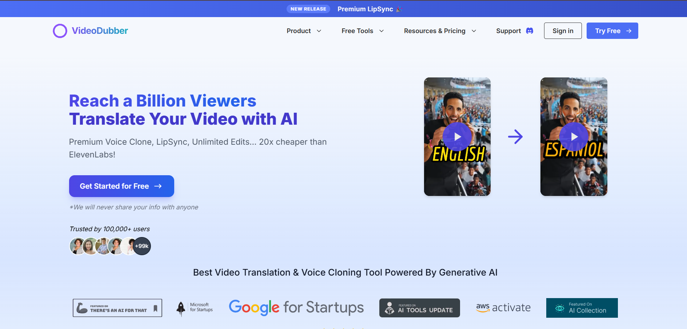
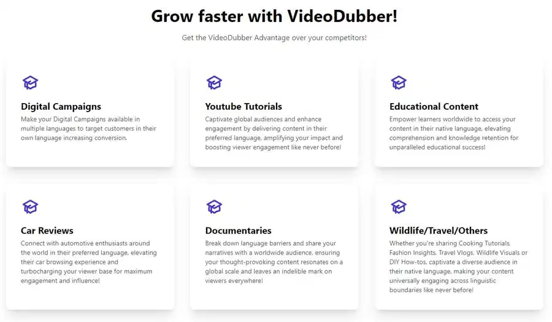
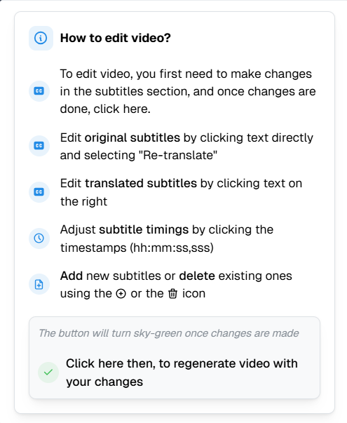
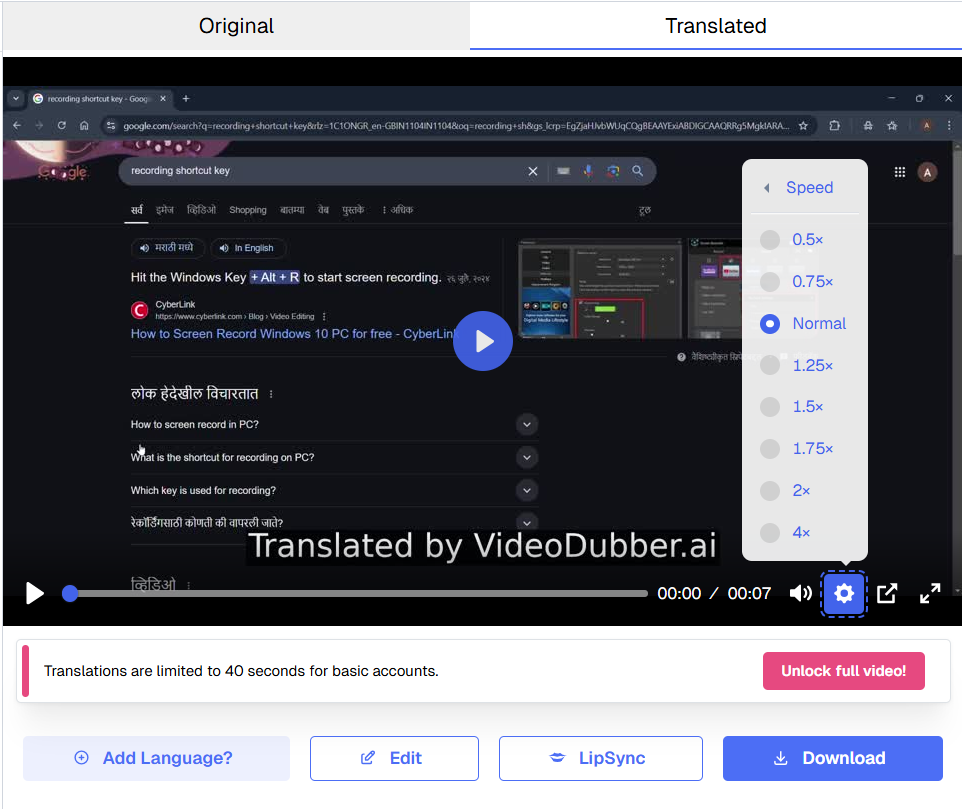
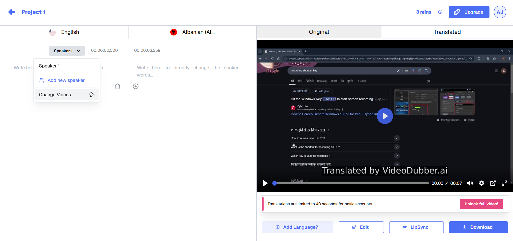
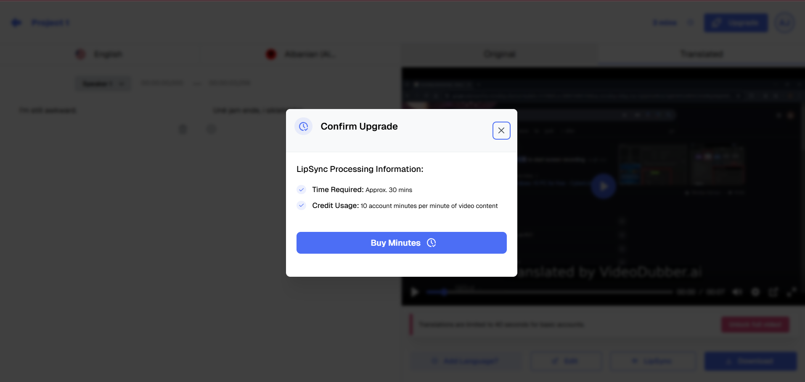
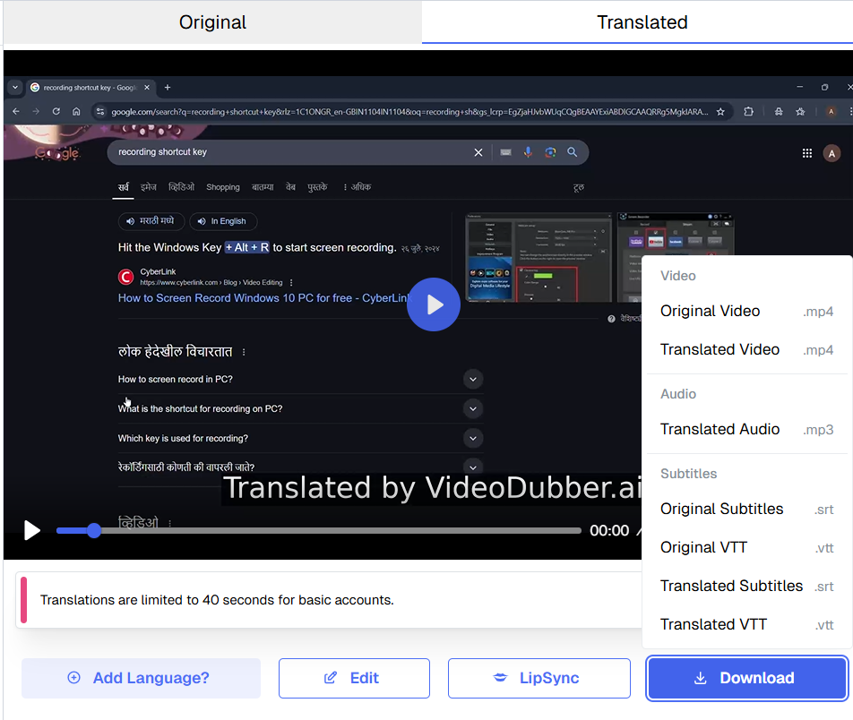

# How to Perfectly Edit Translated Videos with VideoDubber.ai: A Step-by-Step Guide

---

## **TL;DR: Quick Steps to Edit Translated Videos**
1. **Access Editor**: Click "Edit" on your translated video in the dashboard  
2. **Basic Edits**: Trim clips + balance audio levels  
3. **AI Refinements**: Adjust TTS voices, lip-sync, and subtitles  
4. **Preview & Export**: Review changes → Download in 4K/MP4  
✅ **Best for**: Content creators, marketers, and multilingual teams  

**[Try VideoDubber.ai Now](https://videodubber.ai/)**  

---

## **Why Choose VideoDubber.ai for Video Editing?**
These features make it the ultimate tool for translated videos:  

🔹 **AI-Powered Lip-Sync**  
- Automatically matches mouth movements to translated audio  

🔹 **Multilingual TTS Studio**  
- 100+ natural-sounding voices across 30+ languages  

🔹 **Smart Subtitle Sync**  
- AI aligns subtitles with spoken words + customizable styling  

🔹 **One-Click Preview**  
- Instantly check edits without rendering  

🔹 **4K Export**  
- Studio-quality output with no watermark  

 

---

## **Why Editing Matters in Video Translation**

Translating a video is just the first step—professional editing ensures natural pacing, accurate lip-syncing, and polished subtitles. **VideoDubber.ai's** built-in editor simplifies this process with AI-powered tools.

---

## **Step 1: Accessing the Editing Dashboard**

After translation, follow these steps:
1. Go to your **Project Dashboard**.
2. Locate the translated video and click **"Edit"**.
3. The editor opens with a timeline, audio/subtitle tracks, and adjustment panels.

---

## **Step 2: Basic Video Editing Tools**

### **1. Trimming Unwanted Sections**
- Drag the **timeline sliders** to remove intros, outros, or pauses.
- Use **Split Clip** to isolate specific segments.

### **2. Adjusting Audio Levels**
- Balance **voiceover volume** against background music.
- Fix uneven audio with the **gain control** for consistent loudness.

---

## **Step 3: Advanced Translation Refinement**

### **1. Fine-Tune Text-to-Speech (TTS)**
- **Rephrase translations** for better clarity.
- Adjust **speech rate** and **pitch** for natural delivery.
- Use **phonetic overrides** for tricky pronunciations (e.g., names).

### **2. Perfect Lip-Syncing**
- Enable **Auto-Sync** for AI-matched mouth movements.
- Manually tweak timing with the **lip-sync offset tool**.

### **3. Subtitle Synchronization**
- Drag subtitles on the timeline to align with spoken words.
- Edit **font**, **color**, and **position** for readability.

---

## **Step 4: Preview and Export**

### **1. Preview Before Finalizing**
- Click **"Preview"** to review edits in real time.
- Check for sync issues or audio imbalances.

### **2. Export Settings**
- **Resolution:** 1080p or 4K for high-quality output.
- **Format:** MP4 (recommended) or WebM for web use.
- **Subtitles:** Burn into video or export as SRT.

---

## **Pro Tips for Flawless Results**

✅ **Save incremental versions** to backtrack if needed.  
✅ Use **noise reduction** if background audio interferes.  
✅ For marketing videos, **add branded captions** in the editor.

---

## **Ready to Perfect Your Translations?**

VideoDubber.ai combines AI translation with pro-grade editing—no extra software needed.

**[Start Editing Your Video Now](#)**